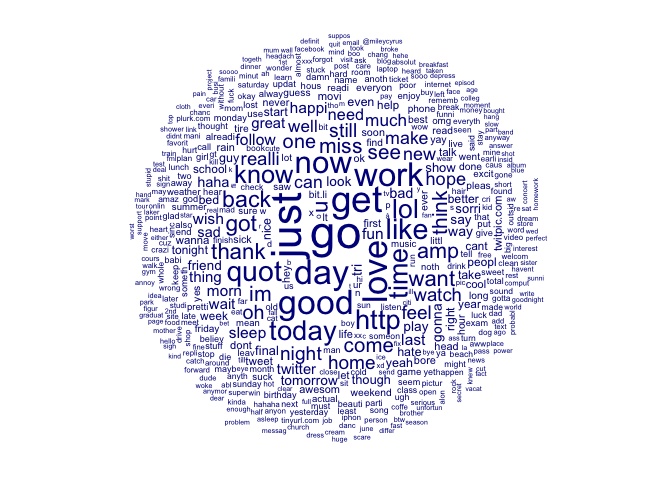

Sentiment Analysis in Tweets
================
Kevin Bonds<br>
<https://www.linkedin.com/in/kevin-bonds/><br>
Date modified: 07 December, 2019

### Introduction

The following is an analysis of the *Twitter Sentiment Analysis Dataset* available at: <http://thinknook.com/twitter-sentiment-analysis-training-corpus-dataset-2012-09-22/>. I will attempt to use this data to train a model to label unseen tweets into **"Positive"** or **"Negative"** sentiment. I will walk through my methodology and include code.

The github repo for my work can be found here: <https://github.com/kwbonds/TwitterSentimentAnalysis>. The file is &gt; 50 MB, so I have not included it in the repo. You will need to download it from the source above and place it in a file called *data* in your working directory (see code below).

### Libraries Used

``` r
library(tidyverse)
library(readr)
library(ggplot2)
library(caret)
library(knitr)
library(quanteda)
library(doSNOW)
library(gridExtra)
```

### Load Data from .zip file

``` r
# Read in the zip file
raw_tweets <-  read_csv(unzip("data/Sentiment-Analysis-Dataset.zip"))
```

### The Data

Take a quick look at what we have.

``` r
# Examine the structure of the raw_tweets dataframe
str(raw_tweets)
```

    ## Classes 'tbl_df', 'tbl' and 'data.frame':    1578603 obs. of  4 variables:
    ##  $ ItemID         : num  1 2 3 4 5 6 7 8 9 10 ...
    ##  $ Sentiment      : num  0 0 1 0 0 0 1 0 1 1 ...
    ##  $ SentimentSource: chr  "Sentiment140" "Sentiment140" "Sentiment140" "Sentiment140" ...
    ##  $ SentimentText  : chr  "is so sad for my APL friend............." "I missed the New Moon trailer..." "omg its already 7:30 :O" ".. Omgaga. Im sooo  im gunna CRy. I've been at this dentist since 11.. I was suposed 2 just get a crown put on (30mins)..." ...
    ##  - attr(*, "problems")=Classes 'tbl_df', 'tbl' and 'data.frame': 27 obs. of  5 variables:
    ##   ..$ row     : int  4285 4285 4286 4286 4287 4287 4287 4287 4287 4287 ...
    ##   ..$ col     : chr  "SentimentText" "SentimentText" "SentimentText" "SentimentText" ...
    ##   ..$ expected: chr  "delimiter or quote" "delimiter or quote" "delimiter or quote" "delimiter or quote" ...
    ##   ..$ actual  : chr  " " " " " " " " ...
    ##   ..$ file    : chr  "'./Sentiment Analysis Dataset.csv'" "'./Sentiment Analysis Dataset.csv'" "'./Sentiment Analysis Dataset.csv'" "'./Sentiment Analysis Dataset.csv'" ...
    ##  - attr(*, "spec")=
    ##   .. cols(
    ##   ..   ItemID = col_double(),
    ##   ..   Sentiment = col_double(),
    ##   ..   SentimentSource = col_character(),
    ##   ..   SentimentText = col_character()
    ##   .. )

|  ItemID|  Sentiment| SentimentSource | SentimentText                                                                                                             |
|-------:|----------:|:----------------|:--------------------------------------------------------------------------------------------------------------------------|
|       1|          0| Sentiment140    | is so sad for my APL friend.............                                                                                  |
|       2|          0| Sentiment140    | I missed the New Moon trailer...                                                                                          |
|       3|          1| Sentiment140    | omg its already 7:30 :O                                                                                                   |
|       4|          0| Sentiment140    | .. Omgaga. Im sooo im gunna CRy. I've been at this dentist since 11.. I was suposed 2 just get a crown put on (30mins)... |
|       5|          0| Sentiment140    | i think mi bf is cheating on me!!! T\_T                                                                                   |
|       6|          0| Sentiment140    | or i just worry too much?                                                                                                 |

``` r
# Convert Sentiment from num to factor and change levels
raw_tweets$Sentiment <- as.factor(raw_tweets$Sentiment)
levels(raw_tweets$Sentiment) <- c("Negative", "Positive")
raw_tweets$SentimentSource <- as.factor(raw_tweets$SentimentSource)
```

We have greater that 1.5M rows. Even though tweets are somewhat short, this is a lot of data. Tokenization will undoubtedly create many more features than can be handled efficiently if we were to try to use this much data. We should probably train on about 5% of this data and use as much of the rest as we want to test. We will make sure to maintain the proportionality along the way. Let's see what that is.

What proportion of "Sentiment" do we have in our corpus?

``` r
# Get the proportion of Sentiment in the corpus
prop.table(table(raw_tweets[, "Sentiment"]))
```

    ## 
    ##  Negative  Positive 
    ## 0.4994473 0.5005527

Looks like almost 50/50. Nice. In this case a random sample would probably give us very similar proportions, we will use techniques to hard maintain this proportion i.e. just as if we had an unbalanced data set.

``` r
# Get the proportion of the SentimentSource
prop.table(table(raw_tweets[, "SentimentSource"]))
```

    ## 
    ##       Kaggle Sentiment140 
    ##  0.000845051  0.999154949

I'm not sure what this *SentimentSource* column is, but it looks like the vast majority is "Sentiment140". We'll ignore it for now.

### Count Features

Let's add some features based on counts of how many hashtags, weblinks, and @refs are in each tweet.

``` r
# Count how many http links are in the tweet
raw_tweets$web_count <- str_count(raw_tweets$SentimentText, "http:/*[A-z+/+.+0-9]*")
# Count haw many hashtags are in the tweet
raw_tweets$hashtag_count <- str_count(raw_tweets$SentimentText, "#[A-z+0-9]*")
# Count how many @reply tags are in the tweet
raw_tweets$at_ref_count <- str_count(raw_tweets$SentimentText, "@[A-z+0-9]*")
# Count the number of characters in the tweet
raw_tweets$text_length <- nchar(raw_tweets$SentimentText)
```

``` r
# View the first few rows 
kable(head(raw_tweets))
```

|  ItemID| Sentiment | SentimentSource | SentimentText                                                                                                             |  web\_count|  hashtag\_count|  at\_ref\_count|  text\_length|
|-------:|:----------|:----------------|:--------------------------------------------------------------------------------------------------------------------------|-----------:|---------------:|---------------:|-------------:|
|       1| Negative  | Sentiment140    | is so sad for my APL friend.............                                                                                  |           0|               0|               0|            40|
|       2| Negative  | Sentiment140    | I missed the New Moon trailer...                                                                                          |           0|               0|               0|            32|
|       3| Positive  | Sentiment140    | omg its already 7:30 :O                                                                                                   |           0|               0|               0|            23|
|       4| Negative  | Sentiment140    | .. Omgaga. Im sooo im gunna CRy. I've been at this dentist since 11.. I was suposed 2 just get a crown put on (30mins)... |           0|               0|               0|           122|
|       5| Negative  | Sentiment140    | i think mi bf is cheating on me!!! T\_T                                                                                   |           0|               0|               0|            44|
|       6| Negative  | Sentiment140    | or i just worry too much?                                                                                                 |           0|               0|               0|            25|

### Some Manual Work

One thing to note: looking into the data it appears that there is a problem with the csv. There is a text\_length greater than the maximum text length twitter allows.

``` r
# get the max character length in the corpus
max(raw_tweets$text_length)
```

    ## [1] 1045

Upon manual inspection we can see that several texts are getting crammed into the column of one.

``` r
# Get the record with the max number of the characters
kable(raw_tweets[which(raw_tweets$text_length == max(raw_tweets$text_length)), "SentimentText"], caption = "Example Text")
```

| SentimentText                                 |
|:----------------------------------------------|
| Brokeback Mountain " was also very excellent. |

8837,0,Kaggle," brokeback mountain was terrible. 8838,0,Sentiment140,\# @Catherine42 I wouldn't mind but I only had 1/2 a portion & then left 1/2 the cream just fruit for me then until my hols x 8839,1,Sentiment140,\# @DeliciousLunch ... dark chocolate cookies? oh you tease! I'm writing to day n dipping into twitter for company 8840,1,Sentiment140,\# followfriday @mstuyvenberg @feb\_unsw @hazelmail @beckescreet - all almost as cool as he-man and she-ra 8841,1,Sentiment140,\# followfriday @presentsqueen because she talks sense 8842,1,Sentiment140,\# New York is the most amazing city i've ever been to 8843,0,Sentiment140,\# number times I bottomed out just in our driveway = 4... a 6.5 hour trip to mass.. I'm scared 8844,0,Sentiment140,\# of NYC celebrity street vendors &gt; \# of POA celebrities <http://streetvendor.org/media/pdfs/Side2.pdf> 8845,1,Sentiment140,\#\#\#\#\#\# yay \#\#\#\#\# thanks @matclayton \#\#\#\#\# 8846,0,Sentiment140,"\#^\#%@ I HATE THE DENTIST, i don't want to go!!! |

How many do we have that are over the 280 character limit?

``` r
# Count of the tweets that are over the character limit
count(raw_tweets[which(raw_tweets$text_length > 280),])$n
```

    ## [1] 21

Looking at these we see a few more examples like above, but also see a bunch or garbage text (i.e. special characters). We'll remove special characters later. This will take care of this by proxy. Also, we'll remove incomplete cases (after cleaning) in case we are left with only empty strings.

For now let's just remove all tweets that are over the limit. We have an abundance of data so it's ok to remove some noise. And check to make sure they are gone.

``` r
# Remove any tweets that are over 280 character counts
raw_tweets <- raw_tweets[-which(raw_tweets$text_length > 280),]
# Check that they have been removed
count(raw_tweets[which(raw_tweets$text_length > 280),])$n
```

    ## [1] 0

Also, I did notice that many of the problem tweets above came from the "Kaggle" source. Kaggle is a Data Science competition platform. It is a great resource for competition and learning. My theory is that this data was used and enriched during a Kaggle competition. It seems disproportionate that several of the problem tweets were from this source. Let's remove them all.

``` r
# Count of "Kaggle" records
count(raw_tweets[which(raw_tweets$SentimentSource == "Kaggle"),])$n
```

    ## [1] 1331

``` r
# Remove the "Kaggle" treets
raw_tweets <- raw_tweets[-which(raw_tweets$SentimentSource == "Kaggle"),]
# Check that they have been removed
count(raw_tweets[which(raw_tweets$SentimentSource == "Kaggle"),])$n
```

    ## [1] 0

### Visualize Distributions of Engineered Features

``` r
# Create 3 plots and display side-by-side
plot1 <- ggplot(raw_tweets,aes(x = text_length, fill = Sentiment)) +
        geom_histogram(binwidth = 5, position = "identity", alpha = 0.5) +
        xlim(-1,140) +
        labs(y = "Text Count", x = "Length of Text",
             title = "Distribution of Text Lengths")
plot2 <- ggplot(raw_tweets,aes(x = at_ref_count , fill = Sentiment)) +
        geom_histogram(binwidth = 1, position = "stack") +
        xlim(-1,3) +
        labs(y = "Text Count", x = "Count of @ref",
             title = "Distribution of @ref")
plot3 <- ggplot(raw_tweets,aes(x = hashtag_count , fill = Sentiment)) +
        geom_histogram(binwidth = 1, position = "stack") +
        xlim(-1,3) +
        labs(y = "Text Count", x = "Count of hashtags",
             title = "Distribution of Hashtags")

grid.arrange(plot1, plot2, plot3, nrow=1, ncol=3)
```


Doesn't look like any of the features we engineered suggest much predictive value. We'll have to rely on tokenizing the text to get our features--unless we can come up with other ideas. We can start with simple tokenozation (i.e. "Bag of Words") and also try some N-grams. Simple Bag of Words tokenization does not preserve the word order or association, but N-grams will cause our feature space to explode and is typically very sparse. This will require some dimensionality reduction--which will certainly add complexity and is a "black-box"" method. i.e we lose the ability to inspect or explain the model.

Let's start creating our test/train set and start modeling.

### Stratified Sampling

Let's create a data partition. First we'll take 4% of the data for training and validation. We'll reserve the indexes so we can further partition later.

``` r
# Set seed for randomizer
set.seed(42)
# Retrieve indexes for partitioning
partition_1_indexes <- createDataPartition(raw_tweets$Sentiment, times = 1, p = 0.004, list = FALSE)
# Create dataframe
train_validate <- raw_tweets[partition_1_indexes, c(2,4)]
# Reset seed
set.seed(42)
# Retrieve indexes for train and test partition
train_indexes <- createDataPartition(train_validate$Sentiment, times = 1, p = 0.60, list = FALSE)
# Use the indexes to create the train and test dataframes
train <- train_validate[train_indexes, ]
test <- train_validate[-train_indexes, ]
# Return the number of records in the training set
nrow(train)
```

    ## [1] 3787

So, now we have 3787 tweets. Check proportions just to be safe.

``` r
# Check proportion is same as original table
prop.table(table(train$Sentiment))
```

    ## 
    ##  Negative  Positive 
    ## 0.4996039 0.5003961

And we have almost exactly the same proportions as our original, much larger, data set.

### Tokenization

Let's now tokenize our text data. This is the first step in turning raw text into features. We want the individual words to become features. We'll cleanup some things, engineer some features, and maybe create some combinations of words a little later.

There are lots of decisions to be made when doing this sort of text analysis. Do we want our features to contain punctuation, hyphenated words, etc.? Typically in text analysis, special characters, punctuation, and numbers are removed because they don't tend to contain much information to retrieve. However, since this is Twitter data, our corpus does contain some emoticons 😂 that are represented as special characters (ex: ":-)", ":-/" ). If we remove them we will lose the textual representations of emotion. But, in looking closely at the data, these emoticons are surprisingly not very prevalent. So let's just remove them.

``` r
# Convert SentimentText column to tokens
train_tokens <- tokens(train$SentimentText, what = "word", 
                       remove_numbers = TRUE, remove_punct = TRUE, remove_twitter = FALSE,
                       remove_symbols = TRUE, remove_hyphens = TRUE)
```

Let's look at a few to illustrate what we did.

``` r
# Inspect tweets tokens
train_tokens[[29]]
```

    ##  [1] "#asterisk"     "meetme"        "does"          "not"          
    ##  [5] "like"          "me"            "it"            "just"         
    ##  [9] "does"          "not"           "do"            "what"         
    ## [13] "I"             "want"          "and"           "no"           
    ## [17] "documentation" "on"            "how"           "to"           
    ## [21] "implement"     "it"            "either"

These are the tokens, from the 29th record, of the training data set. i.e. the tweet below.

``` r
train[29,2]
```

    ## # A tibble: 1 x 1
    ##   SentimentText                                                            
    ##   <chr>                                                                    
    ## 1 #asterisk meetme does not like me... it just does not do what I want, an…

Also this one:

``` r
train_tokens[[26]]
```

    ##  [1] "#3hotwords" "quot"       "GOD"        "loves"      "U"         
    ##  [6] "quot"       "All"        "Day"        "Everyday"   "Believe"   
    ## [11] "that"

We see some upper case is present. Let's change all to lower to reduce the possible combinations.

``` r
# Convert to lower-case
train_tokens <- tokens_tolower(train_tokens)
# Check same token as before
train_tokens[[26]]
```

    ##  [1] "#3hotwords" "quot"       "god"        "loves"      "u"         
    ##  [6] "quot"       "all"        "day"        "everyday"   "believe"   
    ## [11] "that"

### Remove Stopwords

Let's remove stopwords using the quanteda packages built in *stopwords()* function and look at record 26 again.

``` r
# Remove stopwords
train_tokens <- tokens_select(train_tokens, stopwords(), 
                              selection = "remove")
train_tokens[[26]]
```

    ## [1] "#3hotwords" "quot"       "god"        "loves"      "u"         
    ## [6] "quot"       "day"        "everyday"   "believe"

And record 29 again:

``` r
train_tokens[[29]]
```

    ## [1] "#asterisk"     "meetme"        "like"          "just"         
    ## [5] "want"          "documentation" "implement"     "either"

### Stemming

Next, we need to stem the tokens. Stemming is a method of getting to the word root. This way, we won't have multiple versions of the same root word. We can illustrate below.

``` r
# Stem tokens
train_tokens <- tokens_wordstem(train_tokens, language = "english")
train_tokens[[29]]
```

    ## [1] "#asterisk" "meetm"     "like"      "just"      "want"      "document" 
    ## [7] "implement" "either"

You can see that "listened" becomes "listen", and "ticks" becomes "tick", etc.

### Create a Document-Feature Matrix

``` r
# Create a DFM
train_dfm <- dfm(train_tokens, tolower = FALSE)
```

Let's take a quick look at a wordcloud of what is in the dfm.

``` r
# Create wordcloud
train_dfm %>% textplot_wordcloud()
```



``` r
# Convert to matrix
train_dfm <- as.matrix(train_dfm)
```

We now have a matrix--the length of our original data frame--now with 7855 features in the term. That is a lot of features. We are definitely suffering from the "curse of dimensionality". We'll need to do some feature reduction at some point.

``` r
# Check dimensions of the DFM
dim(train_dfm)
```

    ## [1] 3787 7855

Let's look at the first 6 documents (as rows) and the first 20 features of the term (as columns).

``` r
# View part of the matrix
kable(head(train_dfm[1:6, 1:20]))
```

|       |  \#canuck|  glad|  divers|  got|  stavro|  nighter|  yeeeeeeeeeeeessshhhh|  nightmar|  come|  week|  wait|  graduat|  bore|  one|  talk|  anymor|  just|  wanna|  swim|  lap|
|-------|---------:|-----:|-------:|----:|-------:|--------:|---------------------:|---------:|-----:|-----:|-----:|--------:|-----:|----:|-----:|-------:|-----:|------:|-----:|----:|
| text1 |         1|     0|       0|    0|       0|        0|                     0|         0|     0|     0|     0|        0|     0|    0|     0|       0|     0|      0|     0|    0|
| text2 |         0|     1|       1|    1|       1|        0|                     0|         0|     0|     0|     0|        0|     0|    0|     0|       0|     0|      0|     0|    0|
| text3 |         0|     0|       0|    0|       0|        1|                     1|         1|     1|     1|     1|        1|     0|    0|     0|       0|     0|      0|     0|    0|
| text4 |         0|     0|       0|    0|       0|        0|                     0|         0|     0|     0|     0|        0|     1|    1|     1|       1|     0|      0|     0|    0|
| text5 |         0|     0|       0|    0|       0|        0|                     0|         0|     0|     0|     0|        0|     0|    0|     0|       0|     1|      1|     1|    1|
| text6 |         0|     0|       0|    0|       0|        0|                     0|         0|     0|     0|     0|        0|     0|    0|     0|       0|     0|      0|     0|    0|

Now we have a nice DFM. The columns are the features, and the column-space is the term. The rows are the documents and the row-space are the corpus.

``` r
# Bind the DFM, Sentiment together as a dataframe
train_df <- cbind("Sentiment" = as.factor(train$Sentiment), as.data.frame(train_dfm))
kable(train_df[1:10, 1:15])
```

|        | Sentiment |  \#canuck|  glad|  divers|  got|  stavro|  nighter|  yeeeeeeeeeeeessshhhh|  nightmar|  come|  week|  wait|  graduat|  bore|  one|
|--------|:----------|---------:|-----:|-------:|----:|-------:|--------:|---------------------:|---------:|-----:|-----:|-----:|--------:|-----:|----:|
| text1  | Negative  |         1|     0|       0|    0|       0|        0|                     0|         0|     0|     0|     0|        0|     0|    0|
| text2  | Negative  |         0|     1|       1|    1|       1|        0|                     0|         0|     0|     0|     0|        0|     0|    0|
| text3  | Negative  |         0|     0|       0|    0|       0|        1|                     1|         1|     1|     1|     1|        1|     0|    0|
| text4  | Negative  |         0|     0|       0|    0|       0|        0|                     0|         0|     0|     0|     0|        0|     1|    1|
| text5  | Negative  |         0|     0|       0|    0|       0|        0|                     0|         0|     0|     0|     0|        0|     0|    0|
| text6  | Negative  |         0|     0|       0|    0|       0|        0|                     0|         0|     0|     0|     0|        0|     0|    0|
| text7  | Positive  |         0|     0|       0|    0|       0|        0|                     0|         0|     0|     0|     0|        0|     0|    0|
| text8  | Negative  |         0|     0|       0|    0|       0|        0|                     0|         0|     0|     0|     0|        0|     0|    0|
| text9  | Negative  |         0|     0|       0|    0|       0|        0|                     0|         0|     0|     0|     0|        0|     0|    0|
| text10 | Negative  |         0|     0|       0|    0|       0|        0|                     0|         0|     0|     0|     0|        0|     0|    0|

``` r
# Return a sample of the column names 
names(train_df[60:75])
```

    ##  [1] "omggggg"       "later"         "practic"       "tire"         
    ##  [5] "turn"          "horribl"       "seen"          "readi"        
    ##  [9] "complet"       "wash"          "hand"          "new"          
    ## [13] "orlean"        "#followfriday" "@rorubi"       "although"

Unfortunately, R cannot handle some of these tokens as columns in a data frame. The names cannot begin with an integer or a special character for example. We need to fix these. Here is how.

``` r
# Alter any names that don't work as columns
names(train_df) <- make.names(names(train_df), unique = TRUE)
names(train_df[60:75])
```

    ##  [1] "omggggg"        "later"          "practic"        "tire"          
    ##  [5] "turn"           "horribl"        "seen"           "readi"         
    ##  [9] "complet"        "wash"           "hand"           "new"           
    ## [13] "orlean"         "X.followfriday" "X.rorubi"       "although"

### Setting up for K-fold Cross Validation

We will set up a control plan for 30 models. We should be able to use this plan for all our subsequent modeling.

``` r
# Set seed
set.seed(42)
# Define indexes for the training control 
cv_folds <- createMultiFolds(train$Sentiment, k = 10, times = 3)
# Build training control object
cv_cntrl <- trainControl(method = "repeatedcv", number = 10,
                         repeats = 3, index = cv_folds)
```

### Train the First Model

Let's train the first model to see what kind of accuracy we have. Let's use a single decision tree algorithm. This algorithm will, however, create 30 \* 7 or 210 models.

``` r
# Train a decision tree model using the training control we setup
rpart1 <- train(Sentiment ~ ., data = train_df, method = "rpart", 
                    trControl = cv_cntrl, tuneLength = 7)
```

``` r
# Inspect the model output
rpart1
```

    ## CART 
    ## 
    ## 3789 samples
    ## 7758 predictors
    ##    2 classes: '0', '1' 
    ## 
    ## No pre-processing
    ## Resampling: Cross-Validated (10 fold, repeated 3 times) 
    ## Summary of sample sizes: 3410, 3410, 3410, 3410, 3410, 3410, ... 
    ## Resampling results across tuning parameters:
    ## 
    ##   cp           Accuracy   Kappa     
    ##   0.002341671  0.6385143  0.27332586
    ##   0.004257584  0.6297197  0.25561962
    ##   0.004523683  0.6283125  0.25270399
    ##   0.013943587  0.5406930  0.10136887
    ##   0.014191946  0.5399894  0.10030259
    ##   0.024481107  0.5098037  0.04890699
    ##   0.036189462  0.5009174  0.03378669
    ## 
    ## Accuracy was used to select the optimal model using the largest value.
    ## The final value used for the model was cp = 0.002341671.

Outputting the model results we see that we have an almost 64% accuracy already. That isn't bad. Really we want to get to about 90% if we can. This is already better than a coin flip and we haven't even begun. Let's take some steps to improve things.

#### To be continued...
